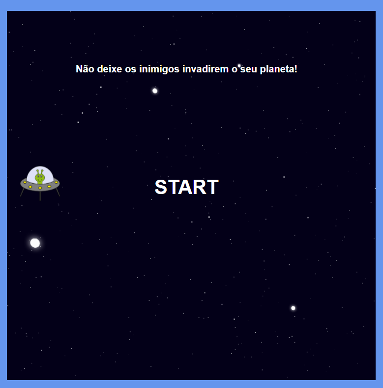

# Nesse projeto, o desafio será criar um Space Shooter utilizando HTML, CSS e Javascript.

## Lógica de programação utilizando posicionamento com CSS, manipulação do DOM, eventListeners, e manipulação de Array.

